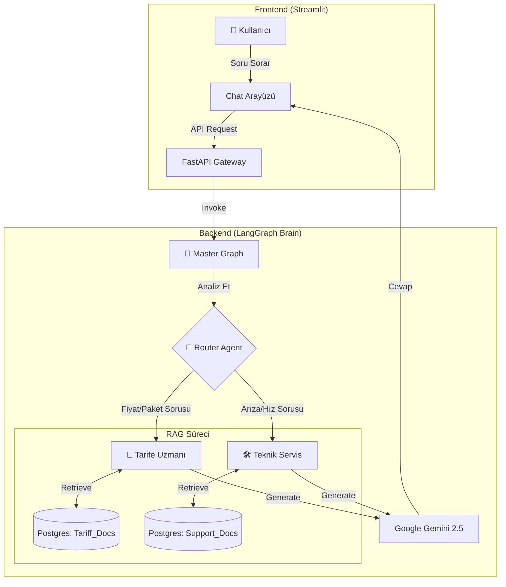

# 🟡 TurkcellChat: Multi-Agent RAG Destekli Akıllı Danışman

<div align="center">

 
 
 
 


</div>

---

## 🚀 Proje Özeti

**Turkcell Asistan**, yeni nesil müşteri deneyimi için geliştirilen, **Çoklu Ajan** mimarisine sahip ileri seviye bir yapay zeka ekosistemidir. Standart chatbotların aksine, bu sistem tek bir LLM'e bağlı kalmaz; **LangGraph** orkestrasyonu ile gelen soruları analiz eder ve ilgili uzman ajana yönlendirir.

Proje, **Retrieval-Augmented Generation** teknolojisi ile güncel PDF dokümanlarını vektörel olarak tarar, hallüsinasyon riskini minimize eder ve bağlama dayalı kişiselleştirilmiş yanıtlar üretir.

### 🌟 Temel Özellikler

* **🤖 Multi-Agent Orkestrasyonu:** "Router" mimarisi ile soruları anlamsal olarak analiz edip doğru departmana (Agent) iletme.
* **📚 Advanced RAG:** PostgreSQL (`pgvector`) üzerinde çalışan, çoklu koleksiyon (Multi-Tenancy) destekli vektör veritabanı.
* **⚡ Google Gemini 2.5 Flash:** Yüksek hız ve düşük maliyetli LLM entegrasyonu.
* **⚙️ Admin Dashboard:** PDF yükleme, kategori yönetimi ve sistem izleme için Streamlit tabanlı modern arayüz.
* **🐳 Cloud-Native:** Docker Compose ile tek komutla kurulum.

---

## 📊 Yetenek Matrisi

Standart bir Chatbot ile Asistan Multi-Agent mimarisinin karşılaştırması:

| Özellik | 🤖 Standart Chatbot | 🟡 Multi-Agent Asistan |
| --- | --- | --- |
| **Bağlam Yönetimi** | Tek Oturum | **Sonsuz (LangGraph Memory)** |
| **Veri Doğruluğu** | Genel Eğitim Verisi | **%100 Kurumsal Doküman (RAG)** |
| **Uzmanlık** | Her işi yarım yapar | **Ayrıştırılmış Uzmanlar (Tarife vs Teknik)** |
| **Yönlendirme** | Yok (Tek Prompt) | **Semantic Router (Niyet Analizi)** |
| **Halüsinasyon** | Yüksek Risk | **Minimize Edilmiş (Grounded Fact)** |


---

## 🛠️ Sistem Mimarisi

Asistan, sorunun kullanıcıdan alınıp cevaba dönüşene kadar izlediği yolu gösteren akış diyagramı:



---

## 🐳 Docker ile Hızlı Kurulum

Projeyi **tek komutla** ayağa kaldırmak için Docker kullanın. PostgreSQL, Backend ve Frontend otomatik kurulur.

```bash
# 1. Projeyi Klonlayın
git clone https://github.com/chyp3r/TurkcellChat.git
cd TurkcellChat

# 2. Ortam Değişkenlerini Ayarlayın (.env)
# GOOGLE_API_KEY ve DATABASE_URL ekleyin.

# 3. Sistemi Başlatın 🚀
docker compose up --build

```

* **Frontend:** `http://localhost:8501`
* **Backend Swagger:** `http://localhost:5050/docs`

---

## 📦 Manuel Kurulum (Local)

Geliştirme ortamı için manuel kurulum adımları:

### Gereksinimler

* Python 3.10+
* PostgreSQL (pgvector eklentisi aktif)

### Adım 1: Sanal Ortam ve Kütüphaneler

```bash
python -m venv venv
source venv/bin/activate  # Windows: venv\Scripts\activate
pip install -r requirements.txt

```

### Adım 2: Backend Başlatma

```bash
cd app
uvicorn main:app --reload --port 5050

```

### Adım 3: Frontend Başlatma

```bash
cd frontend
streamlit run main.py

```

---

## 🤝 İletişim & Katkı

Sorularınız ve önerileriniz için Issues bölümünü kullanabilirsiniz.

<div align="center">
<sub>Powered by LangGraph & Google Gemini. Developed with ❤️ in 2026.</sub>
</div>
